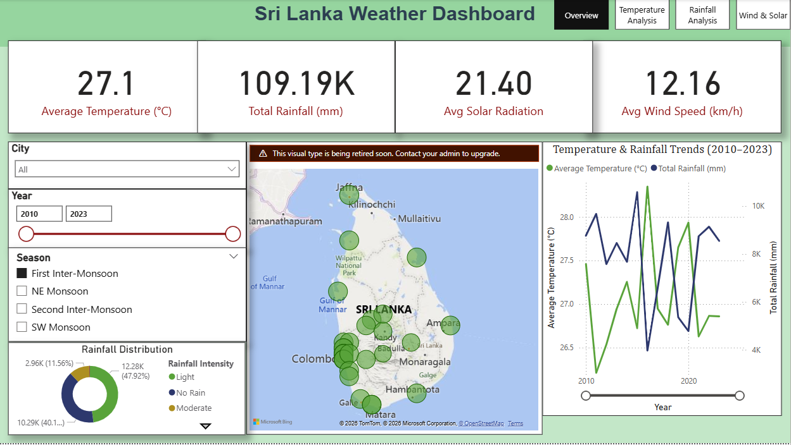
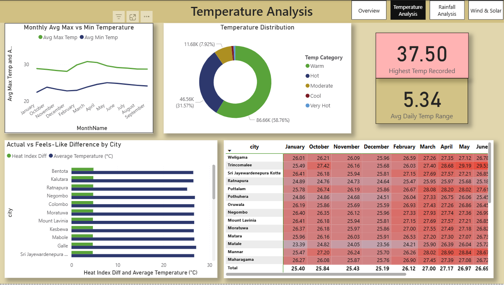
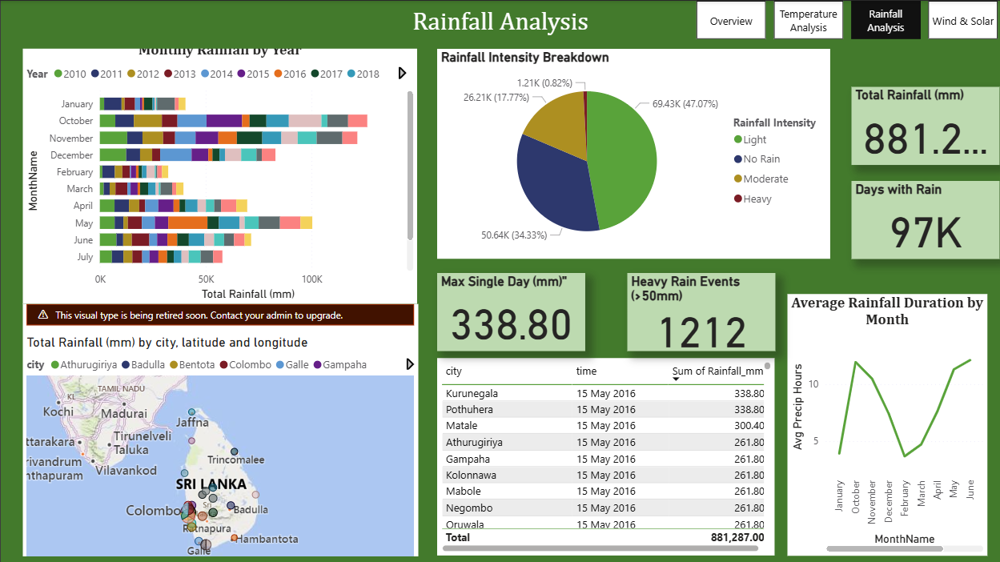
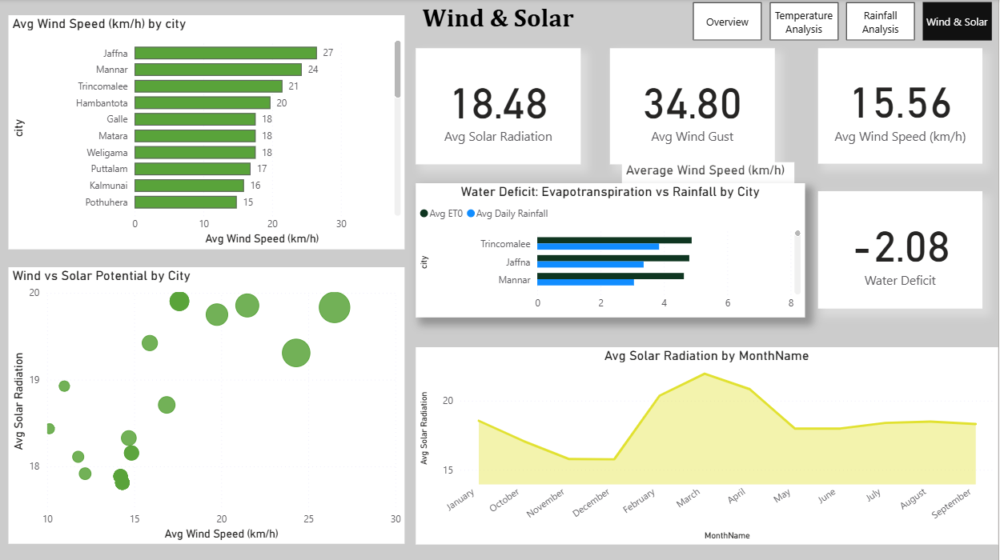

# 🌦️ Sri Lanka Weather Data Analysis — Power BI Dashboard

## Project Overview
An interactive Power BI dashboard analyzing weather patterns across **30 cities** in Sri Lanka using **147,000+ daily records** from 2010 to 2023.

The dashboard transforms raw climate data into actionable visual insights for agriculture, tourism, renewable energy, and disaster management decision-making.

## Dataset
| Detail | Value |
|--------|-------|
| Records | 147,480 daily observations |
| Cities | 30 major Sri Lankan cities |
| Time Period | 2010 – 2023 (13 years) |
| Columns | 24 weather metrics |
| Source | Open-Meteo Historical Weather API |

**Key columns:** temperature (max/min/mean), apparent temperature, rainfall, wind speed, wind gusts, wind direction, solar radiation, evapotranspiration, sunrise/sunset, latitude, longitude, elevation, city

## Dashboard Pages

### 1. 📊 Overview
- KPI cards: Avg Temperature, Total Rainfall, Wind Speed, Solar Radiation
- Bubble map of all 30 cities (size = temperature, color = intensity)
- Yearly trend line with dual axis (temperature + rainfall)
- City, Year, and Season slicers

### 2. 🌡️ Temperature Analysis
- Heatmap matrix: 30 cities × 12 months with blue-to-red conditional formatting
- Monthly max vs min temperature line chart
- Actual vs feels-like temperature comparison
- Temperature category distribution (Very Hot / Hot / Warm / Moderate / Cool)

### 3. 🌧️ Rainfall Analysis
- Monthly rainfall stacked bar chart by year
- Rainfall bubble map (bubble size = total rainfall)
- Precipitation hours trend line
- Top 10 heaviest rainfall days table
- Rainfall intensity breakdown (Heavy / Moderate / Light / No Rain)

### 4. 💨 Wind & Solar Analysis
- Wind speed gauge with energy viability threshold
- Top 10 windiest cities bar chart
- Wind vs Solar scatter plot (identifies hybrid energy potential)
- Solar radiation monthly trend
- Water deficit comparison: ET0 vs Rainfall by city

## Key Insights
1. **Warming trend**: Sri Lanka is gradually warming, with coastal cities warming faster than hill-country cities
2. **Monsoon patterns**: Two distinct rainfall cycles — SW monsoon (May–Sep) and NE monsoon (Oct–Feb)
3. **Wind energy potential**: Hambantota, Trincomalee, and Mannar show the highest wind speeds
4. **Solar zones**: Northern and southeastern dry zone receives the most solar radiation
5. **Extreme weather**: Heavy rainfall events (>50mm) are becoming more frequent in recent years

## Technical Details

### Data Transformation (Power Query)
- Set correct data types for all 24 columns
- Created 7 custom columns: Year, MonthNum, MonthName, Quarter, Season, DaylightHours, TempRange
- Built a separate Date table using DAX CALENDAR function
- Established one-to-many relationship between DateTable and Weather table

### DAX Measures (20+ measures)
| Category | Measures |
|----------|----------|
| Temperature | Avg Mean/Max/Min Temp, Temp Range, Heat Index Diff, YoY Temp Change |
| Rainfall | Total Rainfall, Avg Daily Rainfall, Rainy Days, Heavy Rain Days, Max Rainfall Day, YoY Rainfall % |
| Wind | Avg Wind Speed, Avg Wind Gust, High Wind Days, Wind Energy Score |
| Solar | Avg Solar Radiation, Avg ET0, Water Deficit, Solar-Wind Ratio |

### Calculated Columns
- **Extreme Weather Flag** — precipitation >50mm OR temp >35°C OR gusts >60km/h
- **Temperature Category** — Very Hot / Hot / Warm / Moderate / Cool
- **Rainfall Intensity** — Heavy / Moderate / Light / No Rain
- **Wind Category** — Strong / Moderate / Light

## Tools Used
- **Power BI Desktop** — Dashboard development and visualization
- **Power Query** — Data cleaning and transformation
- **DAX** — Calculated measures and columns

## How to Use
1. Download the `.pbix` file from this repository
2. Open in [Power BI Desktop](https://powerbi.microsoft.com/desktop/) (free from Microsoft)
3. The dashboard is fully interactive — use slicers to filter by city, year, and season

## Screenshots

### Overview Page

### Temperature Heatmap

### Rainfall Analysis

### Wind & Solar Scatter Plot

## Author
[Lakshika Viduranga]

